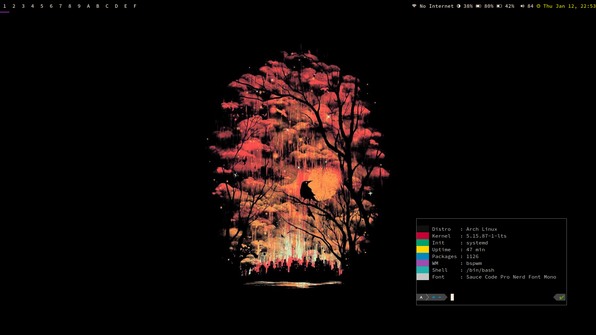

# t480

These are my personal notes & configs for running Arch Linux on a Lenovo ThinkPad T480.  
I run a somewhat minimal setup: x, bspwm, sxhkd, dmenu, polybar, alacritty, fish.

* [Install notes](./Install_notes.md)
* [dotfiles](./dots)
* [Fixing corrupt EFI partition](./EFI_corrupt.md)
* [Random Notes](./Random_notes.md)

