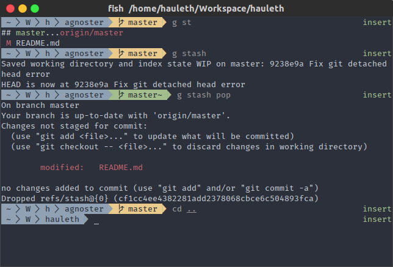

# Fish Agnoster theme

Fancy, colorful theme with support for Powerline fonts.

## Installation

With [Fisher](https://github.com/fisherman/fisherman)

    fisher add hauleth/agnoster

With [Fundle](https://github.com/danhper/fundle) add:

    fundle plugin hauleth/agnoster
    
to your `config.fish` and run `fundle install`.

---

Yeah, really. That's it. Be happy with your fancy new theme.

## Themes

To choose theme run `agnoster <theme>`.

Available themes:

- `default`

  
- `powerline`

  

### Custom theme

You can create your own theme by setting these variables

```
# Segment endings
# AGNOSTER_SEGMENT_SEPARATOR[1] is separator of segment
# AGNOSTER_SEGMENT_SEPARATOR[2] is separator of subsegment
set -U AGNOSTER_SEGMENT_SEPARATOR '' \u2502 # unicode box drawings light vertical (│)

# Icons
set -U AGNOSTER_ICON_ERROR \u2717 # unicode ballot X (✗)
set -U AGNOSTER_ICON_ROOT \u26a1 # unicode high voltage sign (⚡)
set -U AGNOSTER_ICON_BGJOBS \u2699 # unicode gear (⚙)
set -U AGNOSTER_ICON_GIT_BRANCH \u2387 # unicode alternative key symbol (⎇)
set -U AGNOSTER_ICON_GIT_REF \u27a6 # unicode heavy black curved upwards and rightwards arrow (➦)
```

## Licence

Agnoster is MIT licensed. See [LICENSE](LICENSE) file for details.
